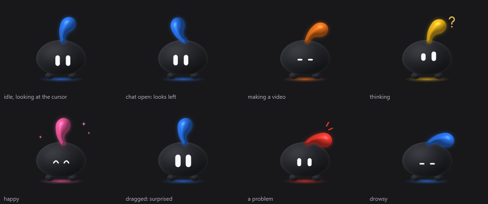
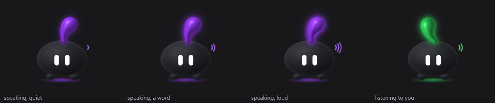
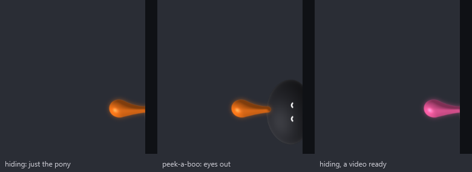
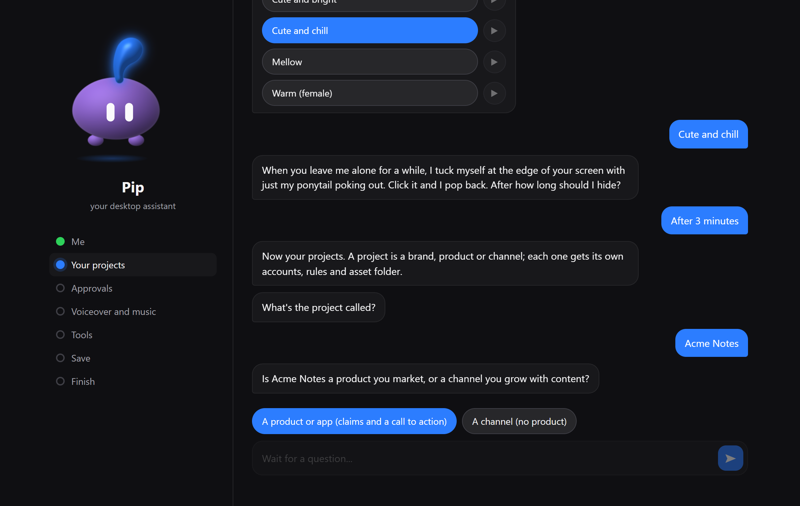

# cc-studio

**Your own content team for short-form video, running on your computer.** cc-studio plans a
week of TikTok and Instagram posts, makes each video with Claude, asks you to approve it, and
schedules the ones you approve. **cc**, a small desktop companion, keeps you in the loop the
whole time.



**Nothing is posted without your yes.** You decide what videos may claim, which accounts they
go to, and whether they post automatically or wait for you to press Post.

## Contents

- [What you get](#what-you-get)
- [How a week works](#how-a-week-works)
- [Before you start](#before-you-start)
- [Setup, step by step](#setup-step-by-step)
- [Your first week](#your-first-week)
- [Everyday use](#everyday-use)
- [Troubleshooting](#troubleshooting)
- [Where your settings live](#where-your-settings-live)
- [Responsible use](#responsible-use) · [Contributing](#contributing) · [License](#license)

## What you get

- **A weekly plan per account.** It reads each account's own analytics, your competitors'
  recent posts and current trends, then plans next week: hook, script, caption, hashtags,
  posting time and a different visual idea for every post.
- **Finished videos.** Claude builds each post into a 1080x1920 video from your real
  screenshots and footage (with HyperFrames, Remotion or ffmpeg), looks for real footage in your
  clip library and free stock sources before generating any scene, adds an ElevenLabs
  voiceover and music if you have a key, checks its own frames, and makes sure it doesn't look
  like your recent videos.
- **Approval on your phone or desktop.** Each video comes to you in Telegram or in cc's chat
  with three buttons: **Approve**, **Redo** (with your note) or **Skip**.
- **Scheduling.** Approved videos go through TikTok Studio's own scheduler, up to 7 days
  ahead, in your real Chrome with your own login. Instagram works through the browser or the
  official Graph API.
- **cc on your desktop** (Windows). Its ponytail shows what's happening (blue: all good,
  orange: making a video, pink: a video is waiting for you, red: a problem). Click it to chat,
  hear it talk in an offline voice, and use buttons for every action. When you leave it
  alone, it hides at the edge of your screen with just its ponytail poking out.

| cc talking | cc hiding at the edge |
|---|---|
|  |  |

## How a week works

```
 Saturday evening     every 30 minutes            you                 every 30 minutes
┌────────────────┐   ┌──────────────────┐   ┌──────────────┐   ┌──────────────────────┐
│ read analytics │──►│ make the next    │──►│ Approve /    │──►│ schedule it on       │
│ plan next week │   │ video (Claude)   │   │ Redo / Skip  │   │ TikTok or Instagram  │
└────────────────┘   └──────────────────┘   └──────────────┘   └──────────────────────┘
```

It makes one video at a time, so you're never flooded: when one is waiting for you, it waits
too. Every step can be stopped at any point (a reboot, sleep, a crash) and simply continues
on the next run.

## Before you start

You need these on your computer. The commands are for Windows (run them in PowerShell);
on a Mac use the links instead.

| What | Why | Install |
|---|---|---|
| **Node.js 22.5 or newer** | runs cc-studio | `winget install OpenJS.NodeJS.LTS` or [nodejs.org](https://nodejs.org) |
| **Git** | downloads cc-studio | `winget install Git.Git` or [git-scm.com](https://git-scm.com) |
| **Google Chrome** | posts with your own login | `winget install Google.Chrome` |
| **FFmpeg** | builds and checks videos | `winget install Gyan.FFmpeg` |
| **Python 3.10 or newer** | the "is this video too similar" check and cc's look | `winget install Python.Python.3.12` |
| **Claude Code** | plans and makes the videos, and powers cc's chat | [claude.com/claude-code](https://claude.com/claude-code), or `npm install -g @anthropic-ai/claude-code` |

After installing Claude Code, run `claude` once in a terminal and log in (a Claude
subscription or an API key both work). Close and reopen your terminal after the installs so
the new commands are found. To check everything at once later, run `npm run doctor`.

**Optional, but recommended:**

- A **Telegram** account, to approve videos from your phone. Setup walks you through making
  a bot; it takes two minutes.
- An **ElevenLabs** API key ([elevenlabs.io](https://elevenlabs.io), Profile > API keys) for
  spoken voiceovers and music. Without it, videos use on-screen text and your own music.
- Free **Pexels** and **Pixabay** API keys ([pexels.com/api](https://www.pexels.com/api/),
  [pixabay.com/api/docs](https://pixabay.com/api/docs/)) for more stock footage. Before
  generating any scene, the creator checks your clip library, then these, then Wikimedia
  Commons' public-domain clips and NASA's video library, which need no key.

**Which systems?** Everything works on **Windows 10 and 11**. On macOS and Linux the
pipeline runs (with cron instead of Task Scheduler), but cc, the desktop companion, is
Windows-only, so you'd approve videos in Telegram.

## Setup, step by step

### 1. Download and install

```bash
git clone https://github.com/gsl0001/cc-studio.git
cd cc-studio
npm install
```

### 2. Run setup

```bash
npm run setup
```

Your browser opens a chat with cc (a page served from your own computer, at
`localhost:4829`; nothing is sent anywhere). Keep the terminal window open until you finish.
Answer by typing or by tapping the buttons; pressing Enter on an empty box keeps the value
shown.



Here is everything it asks, in order:

| Section | Questions | Tips |
|---|---|---|
| **Me** | cc's name, colour, voice (press play to hear each) and when it hides | All changeable later from cc's right-click menu. |
| **Your projects** | name; product or channel; one-line description; audience; website; what videos **may** claim; the call to action; what they must **never** claim; language; video length; the folder for its assets; a word the voice says wrong | A *project* is one brand, app or channel. Only list claims you can prove: the creator never goes beyond them. |
| **Accounts** (per project) | platform; handle; a friendly name; posting times; post automatically or wait for you; what the account is about | Posting times are 24-hour, like `09:30, 18:00`. Skip "what it's about" and the strategist proposes one from the numbers. |
| **Approvals** | set up a Telegram bot, or skip | Use a bot that only cc-studio uses: Telegram gives each bot's messages to one program. |
| **Voiceover and music** | your ElevenLabs key, or skip | Keys go only into the `.env` file on your computer. |
| **Tools** | your Python (it checks it and offers to install what's missing); how the creator gets permission; paid video APIs; local video models | Keep **auto mode** for permissions (see [Security](SECURITY.md)). |
| **Save** | a summary to check | **Start over** if something's wrong. |

Prefer the terminal? `npm run setup:cli` asks the same questions there.

### 3. The finishing steps

After saving, setup shows a list of buttons. Each runs right there and shows its progress:

1. **Log in to each account.** A Chrome window opens on TikTok or Instagram. Log in by hand
   (cc-studio never types a password), then close the window. That login is kept in
   `browser-profile/`, so treat that folder like a password.
2. **Build my look.** Draws cc's avatar (needs Python).
3. **Install my voice.** An offline voice for cc (downloads about 340 MB). Until then cc
   uses the Windows voice.
4. **Start the schedule.** Registers the jobs in Windows Task Scheduler and starts cc, the
   desk server and the Telegram bot. No admin rights needed; they run while you're logged in.
5. **Health check.** Lists anything still missing, each with the command that fixes it.

You can run any of them again later: `npm run login -- <account-id>`, `npm run avatar`,
`npm run voice:install`, `npm run tasks:install`, `npm run doctor`.

### 4. Give it real material

The better the material, the better the videos:

- Put your logos, app screenshots, screen recordings and photos in
  **`workspaces/<project>/assets/`**. Add brand rules (colours, fonts, words to avoid) to
  `workspaces/<project>/README.md`; the creator reads it before every video.
- Run **`npm run assets -- scan`** once (cc does it every 6 hours after that, or say
  `scan assets`). It catalogues every screen, photo and take in the workspace's material
  folders (`assets`, `clips`, `ui`, `photos`, `footage`, ...), has Claude describe each in a
  line (longer videos stretch by stretch, so a search returns the seconds to use), and makes
  contact sheets in `library/sheets/`. The creator then finds your material
  by meaning before anything else, the planner plans from what exists, and the least used
  assets come first so videos keep looking different.
- From your phone: send photos, screenshots or screen recordings to your Telegram bot with a
  caption that starts with the project (`acme the settings screen, dark mode`). Each lands in
  `workspaces/<project>/assets/telegram/`, catalogued at once with your caption as its
  description (no caption: Claude describes it). No project named: the bot asks with buttons.
  Telegram lets a bot download up to 20 MB; put bigger files in the assets folder on the PC.
- Fill in **`content/CONTEXT.md`**: who each account is for and the words people search for.
- Optionally edit **`content/GUIDELINES.md`**, the house rules for every video.

## Your first week

- **Plan.** The plan is made every **Saturday evening**. Don't want to wait? Run
  `npm run strategist` to plan the coming week now.
- **Make.** Every 30 minutes the pulse checks whether a video is needed and starts the
  creator. A video usually takes well under an hour (90 minutes at most).
- **Approve.** When it's ready, cc turns pink and Telegram pings you. Watch it, then Approve,
  Redo with a note ("make the hook shorter"), or Skip.
- **Post.** Approved videos are scheduled from 08:00 onward, at most one upload per run, at
  the times you set.
- **Learn.** Next Saturday it reads how the videos did, and the next plan builds on it.
  Every post gets a score: its views in the first 48 hours against the account's median.
  A format (or hook type) that lands in the account's bottom quarter 3 times in a row is
  dropped for 4 weeks, and one at 1.25x the median or better over 3+ posts gets at least 3
  posts a week. `node src/scorecard.js` prints each account's scorecard.
- **Less approving, once it knows what works.** A video in a format the scorecard has proven
  on that account (3+ scored posts at the median or better), made as the experiment's
  control on the first try, that passes the checks (similarity, size, length, loudness,
  caption), is approved on its own. It waits 6 hours first; Telegram shows it with a
  **Stop** button, and a morning digest lists what went out by itself. Experiments, new
  formats and anything a check flags still come to you. `node scripts/autoapprove.mjs check <key>`
  says why a post would or wouldn't qualify.
- **A daily TikTok check.** Once a day the pulse runs the real upload path on a test video in
  one account's Studio (file, caption, AI label, the schedule pickers) and stops before the
  Schedule button. If TikTok changed something, Telegram tells you that day, with a
  screenshot, before real posts start failing. Nothing is posted.

## Everyday use

**With cc** (click it to open the chat). These answer instantly:

| Say | It does |
|---|---|
| `status`, `what's next`, `this week`, `errors` | tells you where things stand |
| `approve`, `skip`, `redo: <what to change>` | answers the video that's waiting |
| `next`, `next <account>` | makes the next video now |
| `publish now`, `check logins` | uploads due videos now, checks every account is still logged in |
| `pause`, `resume` (or `pause <account>`) | stops or restarts everything, or one account |
| `pause for 3 days`, `pause until Thursday` | pauses now and starts again on its own, with a Telegram message when it does |
| `retry <account>` | starts a failed upload over |
| `move Friday's <account> post to Saturday 6pm` | moves one video that isn't uploaded yet |
| `cancel <account> Oct 10` | drops one video from the queue (asks first; the file stays) |
| `caption for <account> Friday: <new caption>` | changes a caption before upload (`caption for <account> Friday` reads it) |
| `show me Friday's videos` | plays a queued video, or lists them as buttons |
| `asset stock` | how much fresh material each project has, by kind (you also get a Telegram note when it runs low) |
| `scan assets` | catalogues new screens, photos and takes in the workspaces now |
| `clip requests` | the clips the creator asked you for, with search links (answer in Telegram by replying with the video) |
| `no posts on Sundays`, `skip Oct 12`, `days off`, `post on Sundays again` | days off: nothing is planned or posted on them, and queued videos move to the next free day |
| `folders`, `open <folder>` | opens the finished videos, a project's workspace, the week plans, the calendar or the latest report |
| `post at 5pm` (or `post at 5pm for <account>`, `posting time auto`) | sets the daily posting time, after you confirm |
| `mute`, `size small`, `hide` | cc itself |
| `help` | all of the above as buttons |

Anything else goes to Claude, which answers from the live state of your pipeline.
Right-click cc for its menu: voice, colour, size, auto-hide.

**In Telegram:** each new video arrives with Approve / Redo / Skip buttons; an auto-approved
one arrives with a Stop button (or send `stop <key>`). `auto off` sends every video to you
again, `auto on` turns auto-approval back on. Anything else you
send the bot goes to cc: every command above works there, cc's buttons come as Telegram
buttons, and "show me Friday's videos" sends the video into the chat.

**In a terminal:** `npm run status` (the jobs), `npm run logs -- --errors` (recent problems),
`npm run doctor` (a health check), `npm run registry` (checks your project files).

## Troubleshooting

Start with `npm run doctor`: it checks every part and says how to fix what's wrong.

| Problem | Fix |
|---|---|
| **cc isn't on my screen** | It's probably hiding at the edge: look for its ponytail on the left or right side and click it. If it isn't running, `npm run cc` starts it. |
| **cc says it can't reach the desk** | Another program is using port 4820 (or the desk stopped). Restart it with `npm run tasks:install`, or close the other program. |
| **The Telegram bot doesn't answer** | Each bot can be used by one program only. If another tool uses the same bot, make a new one with @BotFather and run setup again. |
| **Uploads fail with a login page** | The account's login expired. Run `npm run login -- <account-id>` and log in again. |
| **Videos stop being made** | Check `npm run logs -- --errors`. A Claude usage limit pauses the creator for two hours; an expired Claude login needs `claude` run once in a terminal. |
| **I want everything to stop now** | Say `pause` to cc or in Telegram. `resume` starts again. For a break, `pause for 3 days` resumes on its own. Videos already scheduled on TikTok still go out. |
| **I want to change an answer** | Run `npm run setup` again (your current values are the defaults), or edit the files below by hand. |
| **I want to remove it** | `npm run tasks:uninstall` removes the scheduled jobs; then delete the folder. |

Reporting a bug? Include the lines from `npm run logs -- --errors` and the output of
`npm run doctor`.

## Where your settings live

Everything is plain files you can open and edit. None of them are uploaded anywhere, and
the ones with your details are kept out of git.

| File | What it holds |
|---|---|
| `studio.config.json` | cc's name, look and voice; AI models; folders; creator rules |
| `.env` | secrets: Telegram, ElevenLabs, Instagram API tokens |
| `apps/<project>/profile.json` | one brand: claims, call to action, video length, accounts, posting times |
| `content/CONTEXT.md` | facts per account: audience, search terms, what works |
| `content/GUIDELINES.md` | the house rules for every video |
| `workspaces/<project>/` | your material, and each video's working folder |
| `finals/<project>/` | finished videos |

Every setting is explained in [docs/configuration.md](docs/configuration.md). How the parts
fit together is in [docs/architecture.md](docs/architecture.md), and Instagram's official
API setup is in [docs/instagram-api-setup.md](docs/instagram-api-setup.md).
`apps/example/` is a complete fictional project to copy from.

## Responsible use

cc-studio automates **your own** accounts through **your own** logged-in browser. Platforms'
terms of service limit automation and they change, so you're responsible for how you use it.
It's built to stay on the right side of them: a person approves every video, you set the
posting volume, the AI-content label matches what was actually made, and it never buys
engagement, follows for follows, or uses unlicensed music.

The creator runs Claude Code on its own while it makes a video. Read [SECURITY.md](SECURITY.md)
for what that means and how logins and secrets are kept.

## Contributing

Issues and pull requests are welcome; see [CONTRIBUTING.md](CONTRIBUTING.md). Run `npm test`
before you open a pull request.

## License

[MIT](LICENSE)
